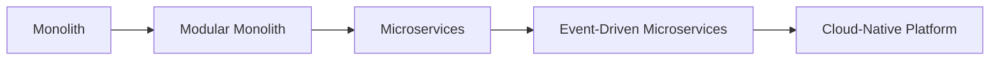

# Java E-Commerce Platform


> A modern, scalable e-commerce platform built with Java Spring Boot, demonstrating the evolution from monolithic architecture to microservices with event-driven design.

---

## Table of Contents

- [Overview](#overview)
- [Architecture Evolution](#architecture-evolution)
- [Tech Stack](#tech-stack)
- [System Architecture](#system-architecture)
- [Features](#features)
- [Microservices](#microservices)
- [Getting Started](#getting-started)
- [API Documentation](#api-documentation)
- [Monitoring & Observability](#monitoring--observability)
- [Deployment](#deployment)
- [Project Structure](#project-structure)
- [Roadmap](#roadmap)
- [Contributing](#contributing)
- [License](#license)

---

## Overview

This project showcases a production-grade e-commerce platform built with **Java 17+** and **Spring Boot 3.x**. It demonstrates the complete journey from a **monolithic architecture** to a **microservices ecosystem** with event-driven communication, distributed tracing, and cloud-native deployment patterns.

### Key Highlights

- **Architecture Evolution**: Monolith → Modular Monolith → Microservices
- **Event-Driven**: Async communication via Kafka, RabbitMQ, and Spring Cloud Streams
- **Cloud-Native**: Docker containerization with Kubernetes orchestration
- **Observability**: Distributed tracing, metrics, and centralized logging
- **Security**: OAuth2/OIDC, API Gateway with rate limiting
- **Configuration**: Externalized config with Spring Cloud Config

---

## Architecture Evolution



| Phase | Description | Status |
|-------|-------------|--------|
| **Monolith** | Single deployable unit with all business logic | ✅ Complete |
| **Modular Monolith** | Domain-driven modules within single deployment | ✅ Complete |
| **Microservices** | Independent services with synchronous REST | ✅ Complete |
| **Event-Driven** | Async messaging with Kafka/RabbitMQ | 🚧 In Progress |
| **Cloud-Native** | K8s deployment with full observability | 📋 Planned |

---

## Tech Stack

### Core Framework
| Technology | Version | Purpose |
|------------|---------|---------|
| **Java** | 17+ / 21 | Primary language |
| **Spring Boot** | 3.x | Application framework |
| **Spring Cloud** | 2023.x | Microservices toolkit |
| **Spring Data JPA** | 3.x | Data persistence |
| **Spring Security** | 6.x | Authentication & Authorization |

### Messaging & Event Streaming
| Technology | Purpose |
|------------|---------|
| **Apache Kafka** | High-throughput event streaming, event sourcing |
| **RabbitMQ** | Traditional message queuing, RPC patterns |
| **Spring Cloud Stream** | Unified messaging abstraction |

### Infrastructure & DevOps
| Technology | Purpose |
|------------|---------|
| **Docker** | Containerization |
| **Kubernetes (K8s)** | Container orchestration |
| **Helm** | K8s package management |
| **Prometheus + Grafana** | Metrics & dashboards |
| **Jaeger / Zipkin** | Distributed tracing |
| **ELK Stack / Loki** | Centralized logging |

### API & Gateway
| Technology | Purpose |
|------------|---------|
| **Spring Cloud Gateway** | API Gateway, routing, rate limiting |
| **OpenAPI 3 / Swagger** | API documentation |
| **Resilience4j** | Circuit breaker, retry, bulkhead |

### Data & Storage
| Technology | Purpose |
|------------|---------|
| **PostgreSQL** | Primary relational database |
| **Redis** | Caching, sessions, distributed locks |
| **MongoDB** | Document storage (catalog, logs) |
| **Flyway / Liquibase** | Database migrations |

### Configuration & Service Discovery
| Technology | Purpose |
|------------|---------|
| **Spring Cloud Config** | Centralized configuration |
| **Consul / Eureka** | Service discovery |
| **Vault** | Secrets management |

---

## System Architecture

```
┌─────────────────────────────────────────────────────────────────────────────┐
│                              EXTERNAL CLIENTS                                 │
│  (Web App │ Mobile App │ Third-party Integrations │ Admin Portal)           │
└─────────────────────────────────┬───────────────────────────────────────────┘
                                  │
                                  ▼
┌─────────────────────────────────────────────────────────────────────────────┐
│                          API GATEWAY (Spring Cloud Gateway)                  │
│              ┌─────────────┬─────────────┬─────────────┐                    │
│              │ Auth/Z Auth │ Rate Limit  │ Routing     │                    │
│              └─────────────┴─────────────┴─────────────┘                    │
└─────────────────────────────────┬───────────────────────────────────────────┘
                                  │
        ┌─────────────────────────┼─────────────────────────┐
        ▼                         ▼                         ▼
┌───────────────┐         ┌───────────────┐         ┌───────────────┐
│  User Svc     │         │  Product Svc  │         │  Order Svc    │
│  (Auth,       │         │  (Catalog,    │         │  (Cart,       │
│   Profile)    │         │   Inventory)  │         │   Checkout)   │
└───────┬───────┘         └───────┬───────┘         └───────┬───────┘
        │                         │                         │
        └─────────────────────────┼─────────────────────────┘
                                  │
                    ┌─────────────┴─────────────┐
                    │   MESSAGE BROKER LAYER    │
                    │  ┌─────────┐ ┌─────────┐  │
                    │  │ Kafka   │ │RabbitMQ │  │
                    │  │(Events) │ │(Commands)│  │
                    │  └─────────┘ └─────────┘  │
                    └─────────────┬─────────────┘
                                  │
        ┌─────────────────────────┼─────────────────────────┐
        ▼                         ▼                         ▼
┌───────────────┐         ┌───────────────┐         ┌───────────────┐
│ Payment Svc   │         │Notification Svc│         │ Shipping Svc  │
│ (Transactions)│         │ (Email, SMS,  │         │ (Logistics,   │
│               │         │  Push)        │         │  Tracking)    │
└───────────────┘         └───────────────┘         └───────────────┘
                                  │
                    ┌─────────────┴─────────────┐
                    │     DATA LAYER            │
                    │  ┌──────┐ ┌────┐ ┌──────┐ │
                    │  │PostgreSQL│Redis│MongoDB│ │
                    │  └──────┘ └────┘ └──────┘ │
                    └───────────────────────────┘
```

---

## Features

### Customer-Facing
- [x] User registration, authentication (OAuth2/OIDC), profile management
- [x] Product catalog with categories, search, filters, pagination
- [x] Shopping cart (persistent, guest + authenticated)
- [x] Checkout flow with address management
- [x] Order history, tracking, returns/cancellations
- [x] Wishlist, product reviews & ratings
- [x] Real-time notifications (email, SMS, push)

### Admin & Operations
- [x] Admin dashboard with analytics
- [x] Product & inventory management
- [x] Order management & fulfillment workflow
- [x] User management & role-based access control
- [x] Promotions, coupons, discount engine
- [x] Content management (banners, pages)

### Technical
- [x] Idempotency for critical operations
- [x] Saga pattern for distributed transactions
- [x] Event sourcing for audit trails
- [x] CQRS for read/write separation
- [x] API versioning strategy
- [x] Comprehensive test coverage (unit, integration, contract)

---

## Microservices

| Service | Port | Description | Database | Status |
|---------|------|-------------|----------|--------|
| **api-gateway** | 8080 | Entry point, routing, auth, rate limiting | - | ✅ |
| **user-service** | 8081 | Authentication, authorization, profiles | PostgreSQL | ✅ |
| **product-service** | 8082 | Catalog, categories, inventory, search | PostgreSQL + MongoDB | ✅ |
| **order-service** | 8083 | Cart, checkout, order lifecycle | PostgreSQL | ✅ |
| **payment-service** | 8084 | Payments, refunds, transactions | PostgreSQL | 🚧 |
| **notification-service** | 8085 | Email, SMS, push, in-app notifications | MongoDB | 🚧 |
| **shipping-service** | 8086 | Logistics, tracking, fulfillment | PostgreSQL | 📋 |
| **config-server** | 8888 | Centralized configuration | Git backend | ✅ |
| **discovery-server** | 8761 | Service registration & discovery | - | ✅ |

---

## Getting Started

### Prerequisites

- **JDK 17+** (recommended: Eclipse Temurin 21)
- **Maven 3.9+** or **Gradle 8+**
- **Docker 24+** & **Docker Compose v2+**
- **kubectl** (for Kubernetes deployment)
- **Helm 3+** (for K8s package management)

### Local Development with Docker Compose

```bash
# Clone the repository
git clone https://github.com/yourusername/java-ecommerce-platform.git
cd java-ecommerce-platform

# Start all infrastructure services
docker-compose -f docker-compose.infra.yml up -d

# Start all microservices
docker-compose up -d

# Verify services
curl http://localhost:8080/actuator/health
```

### Local Development (Manual)

```bash
# 1. Start infrastructure
docker-compose -f docker-compose.infra.yml up -d

# 2. Start Config Server
cd config-server && ./mvnw spring-boot:run

# 3. Start Discovery Server
cd discovery-server && ./mvnw spring-boot:run

# 4. Start API Gateway
cd api-gateway && ./mvnw spring-boot:run

# 5. Start business services (in any order)
cd user-service && ./mvnw spring-boot:run
cd product-service && ./mvnw spring-boot:run
cd order-service && ./mvnw spring-boot:run
```

### Environment Variables

Create `.env` file in project root:

```env
# Database
POSTGRES_HOST=localhost
POSTGRES_PORT=5432
POSTGRES_DB=ecommerce
POSTGRES_USER=postgres
POSTGRES_PASSWORD=postgres

# Redis
REDIS_HOST=localhost
REDIS_PORT=6379

# Kafka
KAFKA_BOOTSTRAP_SERVERS=localhost:9092

# RabbitMQ
RABBITMQ_HOST=localhost
RABBITMQ_PORT=5672
RABBITMQ_USER=guest
RABBITMQ_PASSWORD=guest

# JWT
JWT_SECRET=your-super-secret-key-min-256-bits
JWT_EXPIRATION=3600000

# OAuth2 (Keycloak/Auth0/etc)
OAUTH2_ISSUER_URI=https://auth.example.com
OAUTH2_CLIENT_ID=ecommerce-client
OAUTH2_CLIENT_SECRET=client-secret
```

---

## API Documentation

| Service | Swagger UI | OpenAPI Spec |
|---------|------------|--------------|
| API Gateway | http://localhost:8080/swagger-ui.html | http://localhost:8080/v3/api-docs |
| User Service | http://localhost:8081/swagger-ui.html | http://localhost:8081/v3/api-docs |
| Product Service | http://localhost:8082/swagger-ui.html | http://localhost:8082/v3/api-docs |
| Order Service | http://localhost:8083/swagger-ui.html | http://localhost:8083/v3/api-docs |

### Example API Calls

```bash
# Register a new user
curl -X POST http://localhost:8080/api/v1/auth/register \
  -H "Content-Type: application/json" \
  -d '{"email":"user@example.com","password":"securePass123","firstName":"John","lastName":"Doe"}'

# Login
curl -X POST http://localhost:8080/api/v1/auth/login \
  -H "Content-Type: application/json" \
  -d '{"email":"user@example.com","password":"securePass123"}'

# Get products (with pagination)
curl -X GET "http://localhost:8080/api/v1/products?page=0&size=20&sort=name,asc" \
  -H "Authorization: Bearer <access_token>"

# Create order
curl -X POST http://localhost:8080/api/v1/orders \
  -H "Authorization: Bearer <access_token>" \
  -H "Content-Type: application/json" \
  -d '{"items":[{"productId":"uuid","quantity":2}],"shippingAddressId":"uuid"}'
```

---

## Monitoring & Observability

### Distributed Tracing
- **Jaeger UI**: http://localhost:16686
- **Zipkin UI**: http://localhost:9411
- Trace context propagation via W3C TraceContext headers

### Metrics & Dashboards
- **Prometheus**: http://localhost:9090
- **Grafana**: http://localhost:3000 (admin/admin)
- Pre-built dashboards for:
  - JVM metrics (memory, GC, threads)
  - HTTP latency, throughput, error rates
  - Business metrics (orders, revenue, conversion)
  - Kafka consumer lag
  - Database connection pools

### Logging
- **Loki**: http://localhost:3100
- **Grafana Logs**: Integrated in Grafana
- Structured JSON logging with correlation IDs

### Health Checks
```bash
# Overall system health
curl http://localhost:8080/actuator/health

# Individual service health
curl http://localhost:8081/actuator/health
curl http://localhost:8082/actuator/health
```

---

## Deployment

### Docker Images

```bash
# Build all images
./mvnw clean package -DskipTests
docker-compose build

# Or build individually
cd user-service && ./mvnw spring-boot:build-image
```

### Kubernetes Deployment

```bash
# Add Helm repo
helm repo add ecommerce ./helm
helm repo update

# Install with values
helm install ecommerce ./helm/ecommerce-platform \
  --namespace ecommerce \
  --create-namespace \
  -f values-prod.yaml

# Upgrade
helm upgrade ecommerce ./helm/ecommerce-platform -f values-prod.yaml

# Check status
kubectl get pods -n ecommerce
kubectl logs -n ecommerce -l app=user-service -f
```

### Kubernetes Resources Included
- Deployments with rolling updates
- Services (ClusterIP, LoadBalancer)
- Ingress with TLS termination
- ConfigMaps & Secrets
- HorizontalPodAutoscaler
- PodDisruptionBudgets
- NetworkPolicies
- ServiceMonitor for Prometheus

---

## Project Structure

```
java-ecommerce-platform/
├── .github/                    # GitHub Actions workflows
├── docs/                       # Architecture docs, ADRs, diagrams
├── helm/                       # Helm charts for K8s deployment
├── docker-compose.yml          # Local development stack
├── docker-compose.infra.yml    # Infrastructure only (DB, MQ, etc.)
├── pom.xml                     # Parent POM (Maven) / settings.gradle (Gradle)
├── config-server/              # Spring Cloud Config Server
├── discovery-server/           # Eureka/Consul Service Discovery
├── api-gateway/                # Spring Cloud Gateway
├── user-service/               # User management & auth
├── product-service/            # Product catalog & inventory
├── order-service/              # Cart, checkout, orders
├── payment-service/            # Payment processing
├── notification-service/       # Multi-channel notifications
├── shipping-service/           # Logistics & fulfillment
├── common/                     # Shared libraries (DTOs, exceptions, utils)
└── integration-tests/          # Cross-service integration tests
```

### Module Structure (per service)

```
service-name/
├── src/
│   ├── main/
│   │   ├── java/com/ecommerce/service/
│   │   │   ├── config/         # Configuration classes
│   │   │   ├── controller/     # REST controllers
│   │   │   ├── service/        # Business logic
│   │   │   ├── repository/     # Data access
│   │   │   ├── model/          # Entities, DTOs, events
│   │   │   ├── mapper/         # MapStruct mappers
│   │   │   ├── exception/      # Custom exceptions
│   │   │   └── ServiceNameApplication.java
│   │   └── resources/
│   │       ├── application.yml
│   │       ├── application-dev.yml
│   │       ├── application-prod.yml
│   │       └── db/migration/   # Flyway/Liquibase scripts
│   └── test/
│       ├── unit/               # Unit tests
│       ├── integration/        # Integration tests (@SpringBootTest)
│       └── contract/           # Consumer-driven contracts (Pact)
├── Dockerfile
├── pom.xml / build.gradle
└── README.md
```

---

## Roadmap

### Phase 1: Foundation ✅
- [x] Monolithic e-commerce core
- [x] User authentication & authorization
- [x] Product catalog & inventory
- [x] Order management
- [x] Basic testing & CI/CD

### Phase 2: Modular Monolith ✅
- [x] Domain-driven module boundaries
- [x] Shared kernel & anti-corruption layers
- [x] Module communication via interfaces
- [x] Database per module (logical)

### Phase 3: Microservices Extraction ✅
- [x] Service decomposition
- [x] API Gateway implementation
- [x] Service discovery & config
- [x] Inter-service REST communication
- [x] Distributed tracing setup

### Phase 4: Event-Driven Architecture 🚧
- [ ] Kafka event streaming backbone
- [ ] RabbitMQ for command messaging
- [ ] Spring Cloud Stream integration
- [ ] Event sourcing for orders/payments
- [ ] Saga pattern for distributed transactions
- [ ] Outbox pattern for reliability
- [ ] CQRS read models

### Phase 5: Cloud-Native & Production Hardening 📋
- [ ] Kubernetes manifests & Helm charts
- [ ] GitOps with ArgoCD/Flux
- [ ] Advanced observability (SLIs/SLOs)
- [ ] Chaos engineering (Litmus/Gremlin)
- [ ] Performance testing & tuning
- [ ] Security hardening (mTLS, policies)
- [ ] Disaster recovery & backup strategies
- [ ] Multi-region deployment

### Phase 6: Advanced Features 📋
- [ ] Real-time analytics (Flink/Spark)
- [ ] ML-powered recommendations
- [ ] GraphQL federation
- [ ] Event-driven choreography
- [ ] Polyglot persistence optimization
- [ ] Edge computing integration

---

## Testing Strategy

```bash
# Unit tests (fast, isolated)
./mvnw test

# Integration tests (requires infrastructure)
./mvnw verify -Pintegration-tests

# Contract tests (Pact)
./mvnw verify -Pcontract-tests

# End-to-end tests
./mvnw verify -Pe2e-tests

# Performance tests (Gatling/k6)
k6 run performance-tests/scenarios.js

# Mutation testing (Pitest)
./mvnw org.pitest:pitest-maven:mutationCoverage
```

### Test Pyramid
```
         /\
        /  \     E2E Tests (few)
       /----\
      /      \   Contract Tests
     /--------\
    /          \ Integration Tests (moderate)
   /------------\
  /              \ Unit Tests (many)
 /________________\
```

---

## Contributing

We welcome contributions! Please see [CONTRIBUTING.md](CONTRIBUTING.md) for details.

### Development Workflow

1. Fork the repository
2. Create a feature branch: `git checkout -b feature/amazing-feature`
3. Make your changes with tests
4. Run quality checks: `./mvnw verify`
5. Commit with conventional commits: `git commit -m "feat: add amazing feature"`
6. Push to your fork: `git push origin feature/amazing-feaure`
7. Open a Pull Request

### Code Quality Standards

- **Java**: Google Java Style / Spotless formatting
- **Architecture**: ArchUnit tests for boundary enforcement
- **Dependencies**: DependencyCheck for vulnerabilities
- **Documentation**: ADRs for architectural decisions
- **Commits**: Conventional Commits specification

---

## License

This project is licensed under the MIT License - see the [LICENSE](LICENSE) file for details.

---

## Acknowledgments

- [Spring Boot](https://spring.io/projects/spring-boot) - The foundation
- [Spring Cloud](https://spring.io/projects/spring-cloud) - Microservices toolkit
- [Netflix OSS](https://netflix.github.io/) - Inspiration for patterns
- [Martin Fowler](https://martinfowler.com/) - Architecture patterns
- [Chris Richardson](https://microservices.io/) - Microservices patterns

---

## Support

- **Issues**: [GitHub Issues](https://github.com/yourusername/java-ecommerce-platform/issues)
- **Discussions**: [GitHub Discussions](https://github.com/yourusername/java-ecommerce-platform/discussions)
- **Wiki**: [Project Wiki](https://github.com/yourusername/java-ecommerce-platform/wiki)

---

<div align="center">

**Built with ❤️ using Java & Spring Boot**

*This README will be continuously updated as the project evolves through each architectural phase.*

</div>